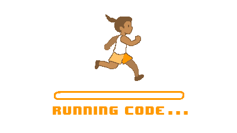
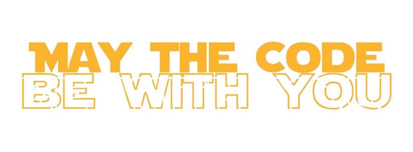

  

<h4 align="center"> Howdy, I'm Harshad Kapei 👋 lives in Mumbai, India.</h4>  

  A passionate:fire: Software Developer <b>< {} ></b> coding for a better world :earth_asia:.  
  Loves :hearts: to code on MEAN,MERN and MEVN stacks....  
<!--   🌱 I'm currently learning:notebook: React.js, Advance Node.js. 
  👯 I’m looking to collaborate on ... MEAN,MERN and MEVN stacks.  -->
  :mailbox: <b>kapeiharshad@gmail.com</b> 
  :briefcase: LinkedIn: http://www.linkedin.com/in/harshadkapei

 
 

  

⚡ Fun fact : <i>Basic's of <b>"English"</b> :sunglasses: is the only thing you needed to learn a programing language :computer:.</i>

<!--
**kapeiharshad/kapeiharshad** is a ✨ _special_ ✨ repository because its `README.md` (this file) appears on your GitHub profile.

Here are some ideas to get you started:

- 🔭 I’m currently working on ...
- 🌱 I’m currently learning ...
- 👯 I’m looking to collaborate on ...
- 🤔 I’m looking for help with ...
- 💬 Ask me about ...
- 📫 How to reach me: ...
- 😄 Pronouns: ...
- ⚡ Fun fact: ...
-->
